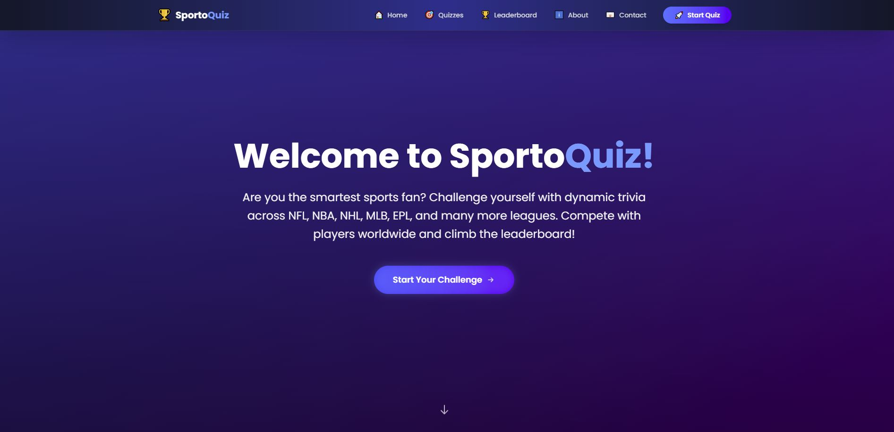

# 🏆 SportoQuiz

An interactive sports trivia web app that generates AI-powered questions to let users compete through a live leaderboard. Built with Next.js, TypeScript, Tailwind CSS, Supabase and powered by OpenAI API.


---

## 🎯 Features

- 🧠 **AI-Generated Trivia**: Questions created by OpenAI API modified by difficulty, user profile, and league.
- 🏆 **Real-Time Leaderboard**: Compete with others and track your ranking live based on scores.
- 🏈 **Multi-League Support**: Choose from all 668 leagues, and top leagues -> **NFL**, **NBA**, **NHL** **MLB**, and **EPL**.
- 🎯 **3 Difficulty Modes**: Select from Rookie, Pro, and Hall of Fame.
- 📇 **Contact Page**: Submit feedback or suggestions using the built-in contact form.
- ⚡ **Fast & Responsive UI**: Built with Tailwind CSS and GSAP for smooth performance and styling.
- 🔁 **CI/CD Integration**: Auto-deploys using GitHub and Vercel for seamless updates.

---

## 🛠️ Setup & Installation

This is a Next.js 14 project using Tailwind CSS, TypeScript, and 1 external APIs. Databased managed by Supabase.

### 1. **Clone the Repository**
```bash
git clone https://github.com/your-username/sportoquiz.git
cd sportoquiz
```

### 2. **Install Dependencies**
```bash
npm install
# or
yarn install
```

### 3. **Add Environment Variables**

Create a `.env.local` file in the root directory and add:

```env
OPENAI_API_KEY=your_openai_api_key
```

### 4. **Run the Development Server**
```bash
npm run dev
# or
yarn dev
```

Then open your browser and go to:
```
http://localhost:3000
```

---

## 📌 Links

- 🌐 **Live Website**: [sporto-quiz.vercel.app](https://sporto-quiz.vercel.app)

---

## 🧠 Tech Stack

- **Frontend**: Next.js 14, React 19, TypeScript, TailwindCSS
- **APIs**: [OpenAI API](https://github.com/marketplace/models/azure-openai/gpt-4o-mini/playground)
- **Deployment**: Vercel (CI/CD auto-deploy from GitHub)
- **Database**: Supabase using SQL

---

## 📄 License

This project is open source and available under the [MIT License](LICENSE).
